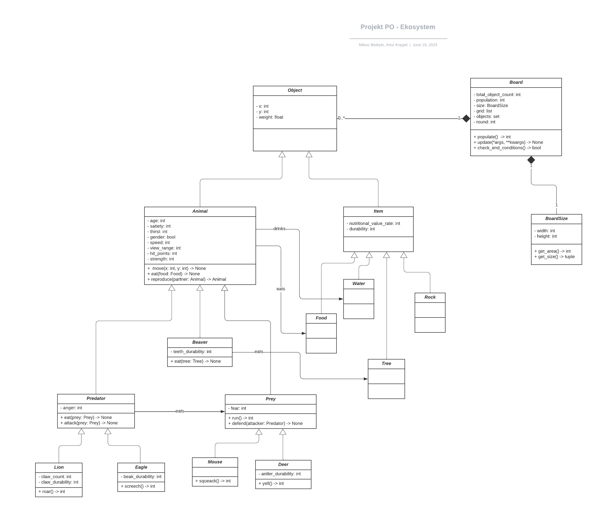
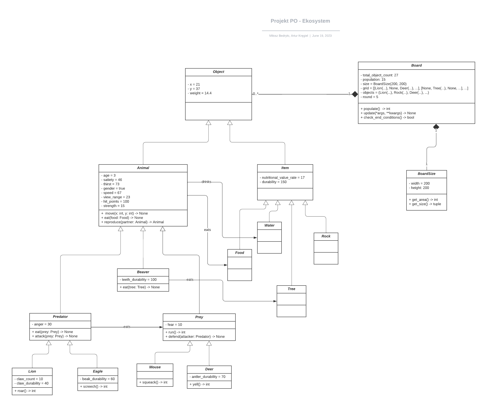
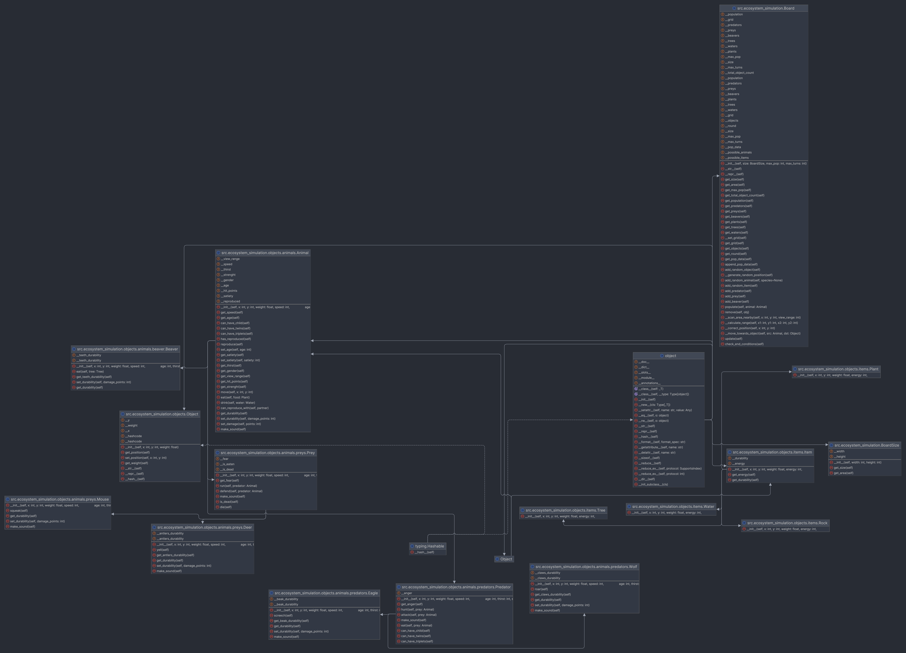

# Projekt na zajęcia laboratoryjne z Programowania obiektowego

## Specyfika

Projekt tworzony jest w języku [Python](https://www.python.org/) (w wersji 3.11.2) z wykorzystaniem biblioteki [Matplotlib](https://matplotlib.org/) do tworzenia wykresów populacji po zakończeniu symulacji.

## Członkowie zespołu

- Bedryło Miłosz - lider
- Kręgiel Artur

## Opis projektu
Jako temat projektu została wybrana symulacja agentowa ekosystemu.
W projekcie zostanie zaimplementowany ekosystem, w którym będzie żyło 5 gatunków zwierząt: wilki, orły, myszy, jelenie i bobry.
Zwierzęta będą posiadały cechy takie jak: prędkość, siła, zdolność do rozmnażania, zdolność do polowania.
Zwierzęta będą się poruszać po mapie, na której będą znajdowały się pola z jedzeniem, wodą, drzewami.
Zwierzęta będą mogły polować na inne zwierzęta.
Zwierzęta będą mogły się rozmnażać.
Zwierzęta będą mogły umierać z głodu, starości, zabicia przez inne zwierzęta.
Zwierzęta będą mogły się poruszać po mapie.
Zwierzęta będą mogły jeść.
Zwierzęta będą mogły pić.

## Zaimplementowane funkcjonalności
- stworzenie mapy (grid 2D)
- stworzenie zwierząt
- stworzenie drzew, wody, jedzenia
- stworzenie funkcji rysującej mapę
- stworzenie funkcji aktualizującej mapę

## Sposób uruchomienia

Najpierw należy sklonować repozytorium z serwisu [GitHub](https://github.com/lolex565/laby-obiektowe):

```
git clone https://github.com/lolex565/laby-obiektowe.git
```

A następnie zainstalować niezbędne biblioteki korzystając z instalatora pakietów [`pip`](https://pip.pypa.io/en/stable/):

```
pip install -r requirements.txt
```

Aby uruchomić program należy wpisać w terminalu będąc w katalogu projektu:

- dodać uprawnienia do uruchamiania skryptów `bash`:

```
chmod +x *.sh
```

- uruchomić skrypt `run.sh`:

```
./run.sh
```

> Aplikacja była testowana na systemach Linux oraz macOS. Nie była uruchamiana na systemie Windows.

## Skrypty bash

- [`run.sh`](run.sh) - uruchamia symulację
- [`test.sh`](test.sh) - uruchamia testy jednostkowe
- [`generate_doc.sh`](generate_doc.sh) - generuje dokumentację w postaci plików `*.html` na podstawie komentarzy w kodzie
- [`clean_pycache.sh`](clean_pycache.sh) - usuwa foldery `__pycache__`

## Struktura projektu

```
projekt-laby
├── clean_pycache.sh
├── csv
│   └── wyniki_2023-06-10_18-04-29.csv
├── doc
│   ├── ecosystem_simulation.html
│   ├── ecosystem_simulation.objects.animals.beaver.html
│   ├── ecosystem_simulation.objects.animals.html
│   ├── ecosystem_simulation.objects.animals.predators.html
│   ├── ecosystem_simulation.objects.animals.preys.html
│   ├── ecosystem_simulation.objects.html
│   ├── ecosystem_simulation.objects.items.html
│   └── ecosystem_simulation.utils.html
├── generate_doc.sh
├── graphs
│   └── wyniki_2023-06-10_18-04-29
│       ├── beaversAndTrees.png
│       ├── populationAndWater.png
│       ├── population.png
│       ├── predatorAndPrey.png
│       └── preysAndPlants.png
├── logs
│   ├── simulation_2023-06-07_19.log
│   ├── simulation_2023-06-07_20.log
│   ├── simulation_2023-06-10_18-02-34.log
│   └── simulation_2023-06-10_18-12-12.log
├── README.md
├── requirements.txt
├── run.sh
├── src
│   ├── ecosystem_simulation
│   │   ├── __init__.py
│   │   ├── objects
│   │   │   ├── animals
│   │   │   │   ├── beaver.py
│   │   │   │   ├── __init__.py
│   │   │   │   ├── predators.py
│   │   │   │   └── preys.py
│   │   │   ├── __init__.py
│   │   │   └── items
│   │   │       └── __init__.py
│   │   └── utils.py
│   └── main.py
├── tests
│   ├── animal_tests.py
│   └── __init__.py
├── test.sh
```

## Dokumentacja

Dokumentacja znajduje się w folderze `doc`. Są to pliki `*.html` wygenerowane za pomocą skryptu `generate_doc.sh`, który wkorzystuje narzędzie [`pydoc`](https://docs.python.org/3/library/pydoc.html).

## Diagramy UML z etapu III

Poniżej są przedstawione diagramy UML utworzone na potrzeby kroku milowego III.

> W finalnej wersji projektu kod aplikacji został wzbogadzony o więcej metod niż te przewidywane w poprzednich etapach.

### Diagram klas



### Diagram obiektów



## Uaktualniony diagram klas



## Przykładowe wykresy


## Przykładowy przebieg symulacji


